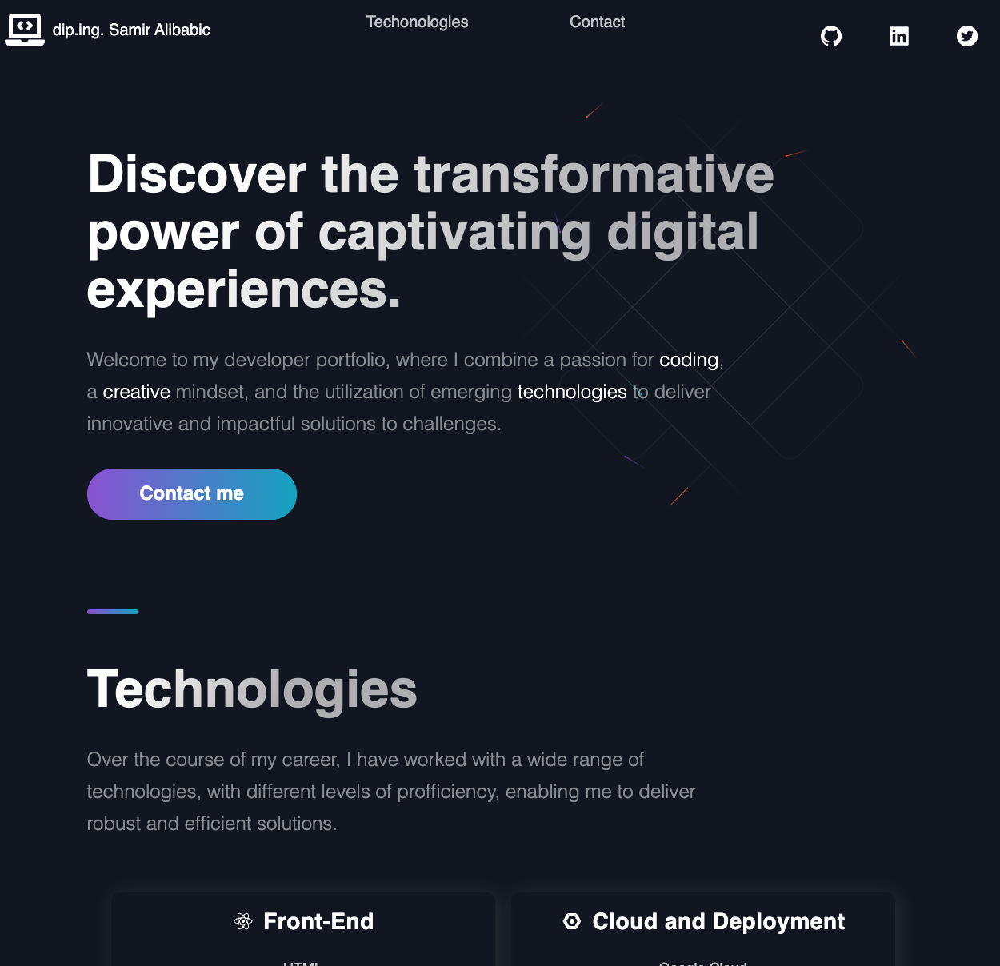

# Developer portfolio



A portfolio with basic information about skills and experience.

[](LICENSE)
[](https://x.com/samiralibabic)

## Table of Contents

- [About](#about)
- [Getting Started](#getting-started)
- [License](##license)

## About

This is a simple personal portfolio site with skills, links to a blogging platform and contact details.

## Getting Started

To run the project locally, type this in your terminal:

```bash
git clone https://github.com/samiralibabic/portfolio.git
cd portfolio
npm install
```

## Licence

This project is licensed under the MIT License - see the [LICENSE](LICENSE) file for details.
